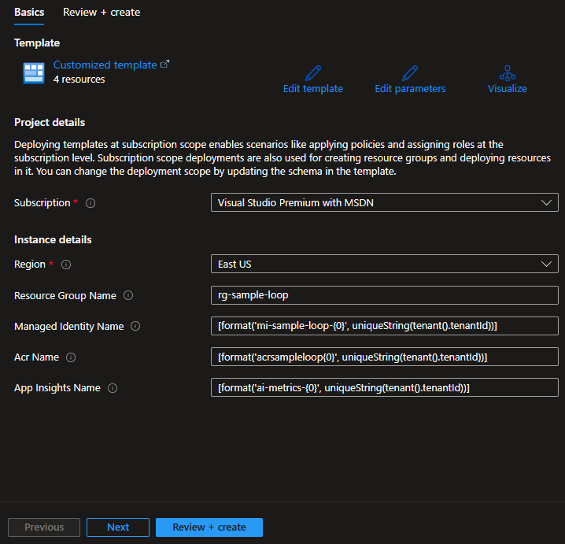
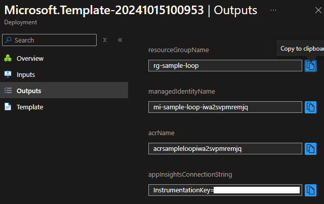
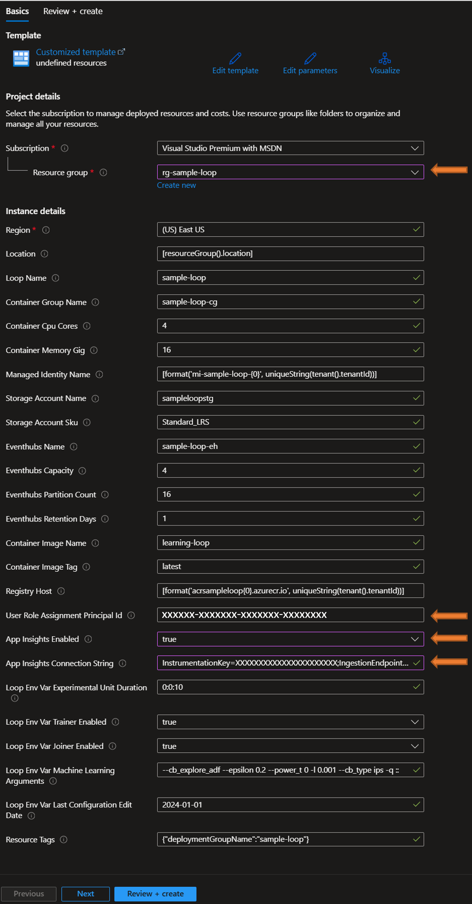
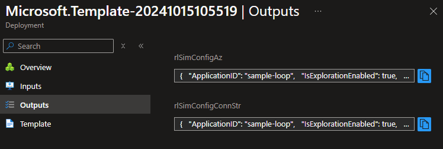
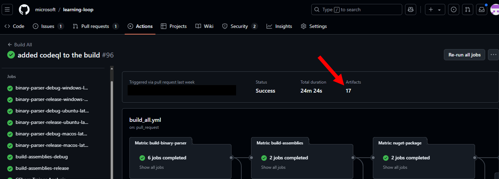

# Deploy a Learning Loop

The deploy folder contains Bicep scripts that facilitate deploying a sample Loop environment. These scripts are designed to create a self-contained deployment of the Loop, but they can also be incorporated into a larger or more customized Azure configuration. This document guides users through prerequisites, quick deployment, manual deployment, and customization options for their environment.

## This Document Contains:

- [Prerequisites](#prerequisites)
- [Quick Start](#quick-start)
- [Scripted Deployment](#scripted-deployment)
- [Manual Deployment](#manual-deployment)
- [Sample Deployment Script Details](#sample-deployment-script-details)
- [Customize a deployment](#customize-a-deployment)

## Prerequisites

Before you begin, ensure you have the following:

1. **A Learning Loop Docker Image**

    The [Quick Start](#quick-start) example does `not` require access to a Docker image. However, access is required for the [Scripted Deployment](#scripted-deployment) and [Manual Deployment](#manual-deployment) examples. See the Docker Image Artifact for more details.

2. **Required Tools**  
   The tools listed below are necessary for setup. You can install each one via your package manager:

   - **Azure CLI** - [Installation Guide](https://learn.microsoft.com/en-us/cli/azure/install-azure-cli)
   - **Docker Engine** - [Installation Guide](https://docs.docker.com/engine/install/)
        
        **Note:** For Linux users, you need to have the necessary permissions to execute Docker commands (e.g., being part of the docker group) to ensure that deployment commands work smoothly.
   - **Git** (required for Quick Start only) - [Installation Guide](https://git-scm.com/downloads)
   - **jq** (Linux only) - [Installation Guide](https://jqlang.github.io/jq/download/)

   ### Linux Installation Commands
   You can use the following commands to install the tools on Linux:

   - **Azure CLI**:  
     ```sh
     sudo apt-get install azure-cli
     ```
   - **Docker Engine**:  
     Follow the instructions here: [Docker Engine Install](https://docs.docker.com/engine/install/).
   - **Git**:  
     ```sh
     sudo apt-get install git
     ```
   - **jq**:  
     ```sh
     sudo apt-get install jq
     ```

   ### Windows Installation Commands
   You can use the following commands to install the tools on Windows:

   - **PowerShell**:  
     Follow the instructions here: [PowerShell Install](https://learn.microsoft.com/en-us/powershell/scripting/install/installing-powershell?view=powershell-7.4).
   - **Azure CLI**:  
     ```powershell
     winget install --id Microsoft.AzureCLI
     ```
   - **Docker Engine**:  
     Follow the instructions here: [Docker Engine Install](https://docs.docker.com/engine/install/).
   - **Git**:  
     ```powershell
     winget install --id Git.Git
     ```

   For Windows users, PowerShell is essential for command-line management of Docker containers.

3. A successful deployment requires permissions to create and manage resources such as Resource Groups, Storage Accounts, Azure Container Registry (ACR), Managed Identities, and KeyVaults in your Azure Subscription.

    - Create Resource Groups
    - Ability to assign roles within the Resource Group
    - Create an Azure Container Registry (ACR)
    - Create Managed Identities
    - Create Storage Accounts
    - Create EventHubs
    - Create KeyVaults
    - Create Azure Container Groups/Instances
    - Create Application Insights

## Quick Start

The following steps utilizes an ARM template deployment from the VowpalWabbit Docker Hub Image repository.

## Quick Start Steps

1) Retrieve Your User Object Id (Optional: If You Want to View Storage Containers)

    - Open a command line terminal

    - Log in to Azure if your not already logged in.

        ```bash
        az login --use-device-code
        ```

    - Retrieve the user Object Id

        ```bash
        az ad signed-in-user show --query 'id' --output tsv
        ```

2) Deploy the Sample Loop

    - Use the `Deploy to Azure` button below to fully deploy the sample loop in a new resource group.

        [](https://aka.ms/AAtf11d)

    - Select the location for deployment.
    - Copy and paste your Client Object Id from step 2 into `User Role Assignment Principal Id`
    - You can accept the remaining defaults and proceed to `Review + Create` and then `Create`.

### Next Steps

The quick start deployment steps deploys a container instance running `rl_sim_cpp` by default. After deployment, you may need to restart the container to resolve any timing issues related to the deployed resources.

For instructions on running the simulator application directly, see [send events to the Learning Loop (run rl_sim_cpp)](RL_SIM.md).

## Scripted Deployment

Follow these steps to set up a new Resource Group and deploy a sample loop using the deploy-sample script.

### Scripted Deployment Steps

1) <a id="quick-start-step1"></a>Download the Learning Loop Docker image artifact.

    See [Docker Image Artifact](#docker-image-artifact) section. Note the file path of the downloaded artifact zip file for use in step 6.

2) Clone the [learning-loop](https://github.com/microsoft/learning-loop) GitHub repository

    ```bash
    git clone https://github.com/microsoft/learning-loop.git
    cd learning-loop/deploy
    ```

3) Log in to Azure

    ```bash
    az login --use-device-code
    ```

4) Start the Docker Engine

    #### Linux

    ```bash
    systemctl start docker.service
    ```
    
    **Note**: If you are using Docker under WSL2 you will need to use Docker Desktop to manage Docker in WSL2.

    #### Windows (and Linux/WSL2)

    Launch the Docker Desktop application

6) Run the deploy-sample script substituting DOCKER-IMAGE-FILE-PATH with the Docker image artifact obtained from step 1.

    #### Linux Script

    ```bash
    chmod +x ./scripts/deploy-sample.sh
    ./scripts/deploy-sample.sh --dockerImageFile DOCKER-IMAGE-FILE-PATH
    ```

    #### Windows Script

    ```bash
    ./scripts/deploy-sample.ps1 -dockerImageFile DOCKER-IMAGE-FILE-PATH
    ```

## Next Steps

The sample deployment script deploys a container instance running `rl_sim_cpp` by default. After deployment, you may need to restart the container to resolve any timing issues related to the deployed resources.

For instructions on running the simulator application directly, see [send events to the Learning Loop (run rl_sim_cpp)](RL_SIM.md).

## Manual Deployment

Create a Learning Loop manually. These steps will require you to login to the Azure Portal using your web browser and in a terminal session. And, as noted in the [Quick Start](#quick-start-step1) section, you will need to [download the Learning Loop artifact](#docker-image-artifact) or build the Docker image.

### Manual Deployment Steps

1) Use the `Deploy to Azure` button below to create a Resource Group, Managed Identity, Azure Insights, and an Azure Container Registry.

    [](https://aka.ms/AAsti3v)

    

    You can accept the defaults and proceed to `Review + Create` and then `Create`.

    When deployment is complete, click on the left menu bar's `Outputs`. The values listed will be needed in Step 4 below.

    

    `Tip: keep this browser page open for reference and use a new browser tab for Step 4.`

2) Load the Docker image to the Azure Container Registry.

    - Open a command line terminal

    - Login to Azure if your not already logged in.

        ```bash
        az login --use-device-code
        ```

    - Login to the ACR created in Step 1 (the name of the ACR is from Step 1 outputs).

        ```bash
        az acr login --name <YOUR-ACR-NAME>
        ```

    - Load the Docker image from the image tar file.

        ```bash
        docker load -i <PATH-TO-THE-DOCKER-TAR-FILE>
        ```

    - Tag the Docker image

        ```bash
        docker tag learning-loop:latest <YOUR-ACR-NAME>.azurecr.io/learning-loop:latest
        ```

    - Push the Docker image to the ACR

        ```bash
        docker push <YOUR-ACR-NAME>.azurecr.io/learning-loop:latest
        ```

3) Get your Client Object Id to assign roles for accessing the Learning Loop's Azure Storage and Azure EventHub.

    Copy the output of the following command for use in Step 4.

    ```bash
    az ad signed-in-user show --query 'id' --output tsv
    ```

4) Use the `Deploy to Azure` button below to create Learning Loop resources (Azure Storage, Azure EventHub, and the Learning Loop Container).

    [](https://aka.ms/AAstpwq)

    

    - Select the Resource Group created in Step 1 from the drop-down.
    - Select True for `App Insights Enabled`
    - Copy and paste the Application Insights Connection string from the output of Step 1.
    - Copy and paste your Client Object Id from step 3 into `User Role Assignment Principal Id`
    - You can accept the defaults and proceed to `Review + Create` and then `Create`.

    When deployment is complete, click on the left menu bar's `Outputs`. There are two output values `rlSimConfigAz` and `rlSimConfigConnStr`.  Copy and paste the value from `rlSimConfigAz` into a new file named rl_sim_config.json (or give it any name you like).

    

5) Prepare the Learning Loop's storage for the Learning Loop simulator.

    **Note** Skip this step if the rl_sim container instance was deployed (this is the default).


    To prepare the newly created Azure Storage Blob for use with rl_sim_cpp, an empty model file must be uploaded. This step initializes the blob container to be ready for the learning loop.

    Create an empty file.

    #### Linux
    ```bash
    touch ./empty_model
    ```

    #### Windows
    ```bash
    new-item -path ./empty_model -ItemType File -Force
    ```

    Initialize storage

    Replace the storage account name according to your deployment.

    ```bash
    az storage blob upload --account-name <YOUR-STORAGE-ACCOUNT-NAME> --container-name "sample-loop/exported-models" --file ./empty_model --name "current"
    rm ./empty_model
    ```

### Next Steps

The manual deployment steps deploys a container instance running `rl_sim_cpp` by default. After deployment, you may need to restart the container to resolve any timing issues related to the deployed resources.

For instructions on running the simulator application directly, see [send events to the Learning Loop (run rl_sim_cpp)](RL_SIM.md).

## Docker Image Artifact

The Docker image is currently built with GitHub Actions and does not currently reside in a public repository.  We are working to make the image public and will update this document when complete.

In the meantime, download the Learning Loop Docker image artifact from the [latest successful build](https://github.com/microsoft/learning-loop/actions?query=is%3Asuccess). Click on the link to the latest successful build, then click on the Artifacts link located in the header of the page (or scroll to the bottom of the page). Select the link labeled `docker-image-ubuntu-latest`.



*If you are unable to access the artifacts, you will need to [build the project](BUILD.md) and [the Docker image](DOCKER.md).*

### Unpack the tar'd Docker image

If you downloaded the Docker image artifact from GitHub, you will have a zip file containing the Docker image tar file.  For the [Quick Start](#quick-start) steps this is all you need. For the [Manual Deployment Steps](#manual-deployment-steps), you will need to manually unzip the file.

- unzip the artifacts file.

    ```bash
    unzip docker-image-ubuntu-latest.zip
    ```

`learning-loop-ubuntu-latest.tar` is Learning Loop Docker image tar file needed for [Manual Deployment Steps](#manual-deployment-steps)

## Sample Deployment Script Details

The deploy-sample script sets up a resource group to deploy the Learning Loop image (see `get-help ./deploy/scripts/deploy-sample.ps1` or `./deploy/scripts/deploy-sample.sh --help`). The script executes in three phases.

- **Phase 1**: creates a Resource Group where the Loop resources will be deployed. If using an Azure Container Registry, the repository will be created here. Since Managed Identity is used by the Loop to access storage and EventHub resources, a Managed Identity will also be created.

- **Phase 2**: pushes the specified tar'd Docker image to either an Azure Container Registry or a Docker Hub repository.

- **Phase 3**: deploys the Azure Container, the Storage Account, and the EventHub.

A full deployment using the deploy-sample script will deploy all required resources and generate two files.

- `<loopName>.bicep` - contains the parameters for deploying the application environment, including the Learning Loop container, EventHub, and the Storage Account. This parameters file is used with `main.bicep` and can be re-run independently of the script.
- `<loopName>.config.json` - contains the JSON config parameters for use with `rl_sim_cpp`

## Customize a deployment

See the Bicep scripts and [README](deploy/README.md) in the project deploy folder for deployment details.
